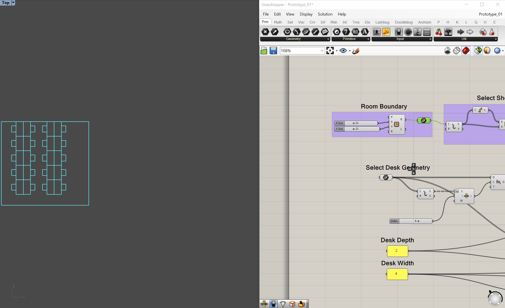
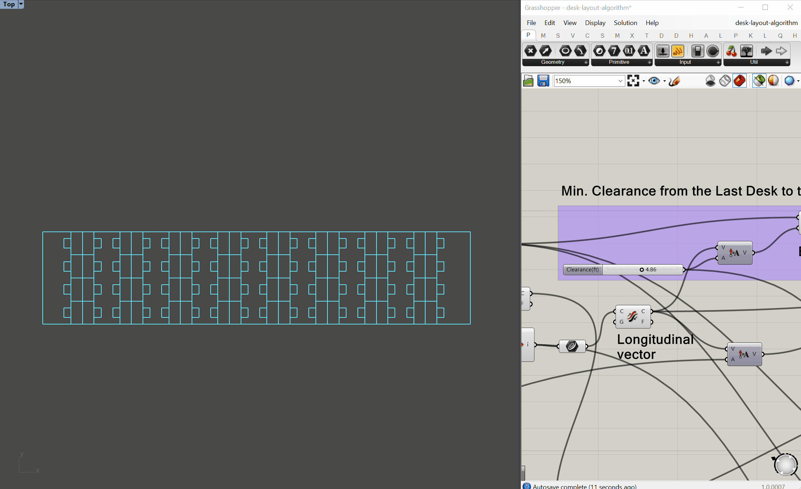

# Augmented Layout Tools
Miscellaneous Prototypes of Augmented Layout Tools

## Spatial Grid Generator
Generate spatial grid module based on the core & shell configuration of a base building

## Quick Desk Layout
Generate a desk layout based on the provided room boundary and specified back-to-back clearance dimensions

